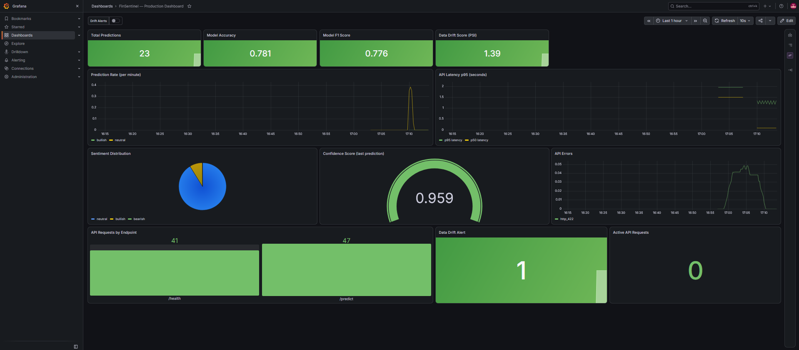

# FinSentinel

French financial sentiment analysis, from data collection to a fine-tuned CamemBERT served behind a monitored production stack.

FinSentinel classifies French financial text as bearish, bullish or neutral, serves it through an instrumented API, and monitors the model in production with Prometheus, Grafana and a Population Stability Index drift detector. The monitoring layer observes real inference traffic, not synthetic data - that distinction is the point of Module 3.

## Project structure

| Module | Name | Status | Scope |
|--------|------|--------|-------|
| M1 | Data and model | Complete | RSS/PDF/dataset ingestion, French text preprocessing, CamemBERT fine-tuning, published on Hugging Face |
| M2 | Serving | Complete | FastAPI inference API, Docker image with embedded model, MLflow tracking, Streamlit dashboard |
| M3 | Monitoring | Validated end to end | Prometheus instrumentation, PSI drift detection, provisioned Grafana dashboard |

## Module 1: Data and model

Ingestion covers three sources: financial RSS feeds, PDF reports, and dataset files, feeding a French-specific preprocessing layer before training.

CamemBERT base fine-tuned for three-class sentiment on French financial text. The figures below are the evaluation metrics of the published checkpoint, as computed by `src/training/evaluate.py` and exposed by the API's `/info` endpoint.

| Metric | Value |
|--------|-------|
| Accuracy | 0.7808 |
| F1 score (weighted) | 0.7759 |

The model is published at [`Walid692/finsentinel-camembert`](https://huggingface.co/Walid692/finsentinel-camembert) and downloaded at image build time, so the container is self-contained and needs no network access at runtime.

The reference distribution used by the drift detector - 64 percent neutral, 19 percent bullish, 16 percent bearish - reflects an imbalanced training set. That imbalance is invisible in the accuracy figure, and the F1 above is weighted, which flatters it further. It is however plainly visible in production - see the Module 3 findings.

## Module 2: Serving

FastAPI application exposing the model:

- `POST /predict` - sentiment, confidence score and measured latency for one text
- `GET /health` - readiness check, returns 503 while the model is still loading
- `GET /info` - model metadata and published metrics
- `GET /metrics` - Prometheus scrape endpoint (added in Module 3)

Packaged as a Docker image with the model weights baked in, alongside MLflow for run tracking and a Streamlit dashboard for interactive use.

## Module 3: Monitoring

Observability for a model in production: what it predicts, how fast, and whether its behaviour is drifting away from what the training data led us to expect.

### Architecture

Four containers, orchestrated by Docker Compose:

- `finsentinel-api` (8000) - the instrumented API. It owns the model and is the single source of application metrics.
- `finsentinel-prometheus` (9090) - scrapes `/metrics` every 10 seconds, 15-day retention, alert rules loaded from `configs/alert_rules.yml`.
- `finsentinel-grafana` (3000) - datasource and dashboard both provisioned from `configs/grafana/provisioning`, so a fresh stack comes up with a working dashboard and no manual setup.
- `finsentinel-mlflow` (5000) - experiment tracking.

### Design decisions

Metrics are emitted by the API itself, not by a side service. An earlier design ran the monitoring module as a separate container; it exposed metrics derived from hardcoded sample predictions, so Prometheus was scraping numbers that said nothing about real traffic. The monitoring module is now a pure library imported by the API, which calls it on every inference. A monitoring stack that has never been exercised by real requests is an untested hypothesis, not a monitoring stack.

The metric definitions and the PSI computation live in one module. `src/monitoring/prometheus_metrics.py` owns the fourteen metrics and the drift logic; `src/api/main.py` calls into it and exposes the registry. Neither file duplicates the other's responsibility.

A middleware tracks every request, not just predictions. Endpoint, method, status code and in-flight count are recorded for all traffic, `/metrics` excluded to avoid self-observation inflating the counters on each scrape.

PSI is computed on a sliding window of the last 100 predictions, and only above 20 samples. Below that, the index is dominated by sampling noise. The alert threshold is 0.25, the standard reading for significant drift, deliberately left untuned.

### Metrics

| Family | Metrics |
|--------|---------|
| Predictions | total by label and use case, latency histogram, last confidence, confidence summary |
| Sentiment | count and sliding-window ratio per label |
| Model | accuracy, F1, metadata gauge |
| API | requests by endpoint/method/status, errors by type, active requests |
| Drift | PSI score, drift alert flag |

### Validation protocol

`scripts/generate_traffic.py` drives a two-phase scenario against the running stack, so the result is reproducible rather than a one-off manual test.

| Phase | Traffic | Predicted labels | PSI | Alert |
|-------|---------|------------------|-----|-------|
| 1 - mixed baseline | 12 varied financial statements | 10 neutral, 2 bullish | 0.0 (below the 20-sample floor) | 0 |
| 2 - deliberate shift | 10 strongly negative statements | 10 neutral | 1.3904 | 1 |

Phase 1 confirms the noise guard: with 12 samples the index is not computed at all. Phase 2 confirms the detector reacts to a distribution shift, well above the 0.25 threshold.



### Findings

The drift detector works, and it caught something other than what it was pointed at. PSI is computed on the model's *predictions*, not on its *inputs*. In phase 2 the input distribution shifted violently while the model kept returning the same label, and the index still fired - because uniformity itself is a departure from the expected 16/19/64 split. A genuine input-drift monitor (text length, vocabulary, embedding distance) would measure something different. The distinction matters for anyone reading the dashboard: this panel reports that the model's behaviour has changed, not that the incoming text has.

The model never predicted bearish once. Across the requests sent during this validation - including "collapse of the share price", "imminent bankruptcy", "accounting fraud revealed by auditors" and "default on bond debt" - the negative class was never returned. This is a clear bias toward the majority class of the training set, and it is invisible in the 78 percent accuracy figure. Monitoring surfaced in one afternoon a weakness that offline metrics had hidden since training - which is the argument for the module.

The error panel was validated by accident. Malformed requests sent during testing were correctly captured and labelled `http_422` by the middleware, which proves the error tracking path works without a fault having to be simulated on purpose.

### Reproducing

```bash
# Bring up the full stack (API, Prometheus, Grafana, MLflow)
cd docker && docker compose up --build -d

# Run the two-phase validation scenario
python scripts/generate_traffic.py

# Grafana: http://localhost:3000 (admin / finsentinel2026)
# Prometheus: http://localhost:9090
```

## Installation

```bash
git clone https://github.com/AhmedWalidbou/FinSentinel.git
cd FinSentinel
conda create -n finsentinel python=3.11 -y
conda activate finsentinel
pip install -r requirements.txt
```

## Technology

Python 3.11, PyTorch (CPU), Transformers, FastAPI, Uvicorn, Pydantic, prometheus-client, MLflow, Streamlit, Docker Compose, Prometheus, Grafana.

## Roadmap

Input-level drift monitoring, to complement the prediction-level PSI: tracking text length, out-of-vocabulary rate and embedding distance to the training distribution would detect a shift in incoming data before the model's output changes.

Class-imbalance work on the model, motivated directly by the production finding: class weighting or resampling, evaluated on per-class recall rather than on global accuracy, which the current imbalance flatters.

Alertmanager wiring, so the alert rules already defined in `configs/alert_rules.yml` deliver notifications rather than only appearing on the dashboard.

## License

MIT